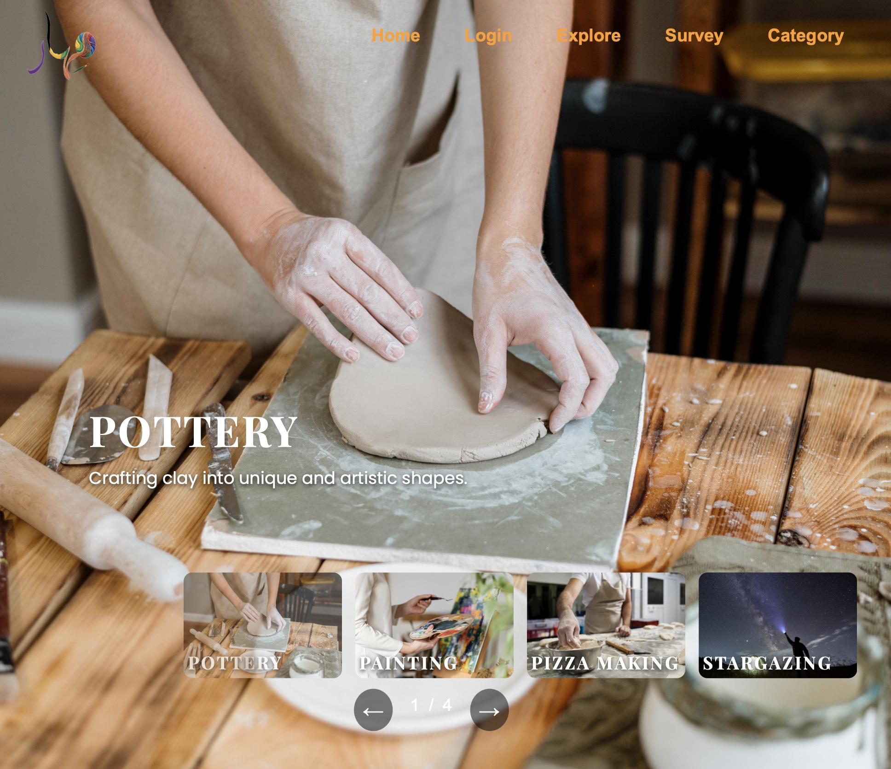
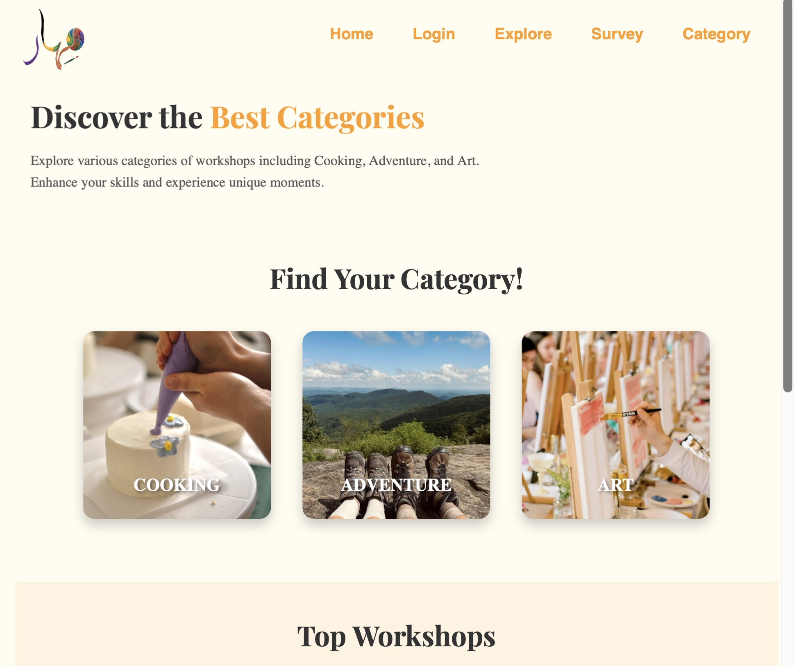
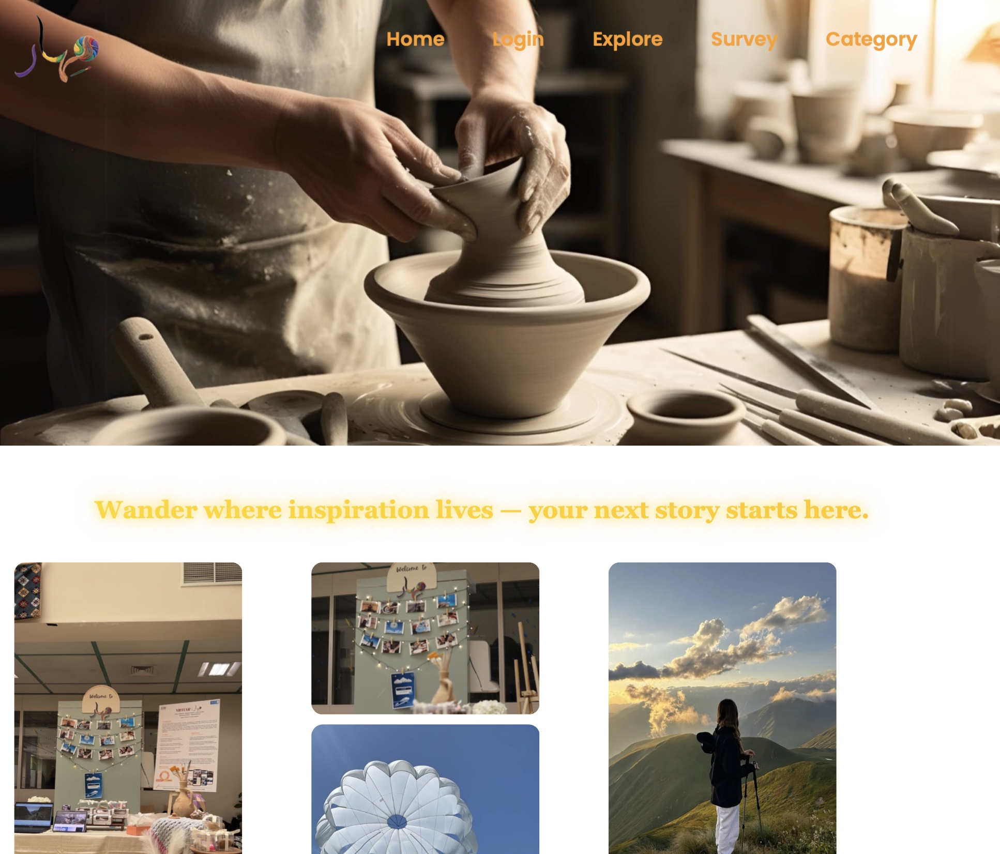

# 🌟 Mehar – Workshop Exploration & Booking Platform

🌐 **Live Demo:**  
[Visit Mehar Platform](https://mehar.infinityfreeapp.com/homepage.php)

## 📌 Overview

Mehar is an online platform designed to simplify the discovery and booking of workshops across various fields. The system enables users to explore skill-development opportunities and manage their learning journey through an intuitive and flexible interface.

The platform allows users to browse categorized workshops, book sessions, modify reservations, or cancel them seamlessly.

---

## 🚀 Key Features

- 🔎 Categorized workshop browsing based on user interests  
- 📅 Flexible booking management (add, edit, cancel reservations)  
- 🌐 Multiple attendance formats:
  - Online
  - In-person
  - Hybrid
- 🎯 Personalized recommendation system based on a short preference survey  
- ⭐ Workshop rating and review system  
- 🧭 Explore page for sharing experiences and learning journeys  
- 👥 Community engagement through user-generated content  

---

## 🧠 Recommendation System

Mehar includes a short survey that identifies user preferences and learning interests. Based on the responses, the system suggests workshops tailored to individual goals, enhancing personalization and engagement.

---

## 🎯 Project Objective

The goal of Mehar is to provide a centralized platform that empowers users to continuously develop their skills through accessible and well-organized learning opportunities.

---

## 👥 Team Collaboration

This project was developed as part of a collaborative team effort.

### Team Members
- Hadeel Almutairi
- Aljawharah Alsubaie
- Mashael Alammar
- Rahaf Alfantoukh
- Leena Alhaider

---

## 👩‍💻 My Contribution

- Designed core user interfaces and layout structure.
- Planned user flow and improved overall user experience (UX).
- Implemented the workshop booking feature and integrated it with the database.
- Collaborated in feature planning and system refinement.
- Participated in testing and debugging.

---

## 🧩 Future Improvements

- Advanced AI-driven recommendation system  
- User dashboard analytics  
- Integrated payment gateway  
- Real-time notifications  
- Workshop provider management panel  
## 📷 Screenshots

### 🏠 Home

### 🎨 Category

### 🔎 Explore

### 📝 Survey

